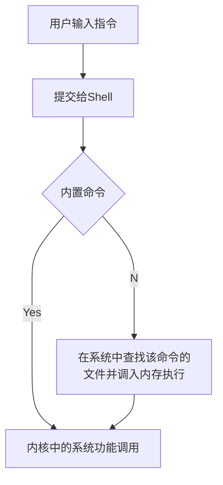

## 使用是 shell

> Shell 是系统的用户界面，提供了用户与内核进行交互操作的一种接口（命令解释器）

Sehll可以执行：

* 内部命令

* 应用程序

* shell脚本

> 使用 type 命令可以区分内部命令和外部命令

## 我们需要了解shell那些？

* 命令行解释

* 命令的多种执行顺序

* 通配符

* 命令补全、别名机制、命令历史

* I/O重定向（input/output redirection）

* 管道（pipes）

* 命令替换

* shell编程语言

* 

## 参考

看完这篇Linux基本的操作就会了
